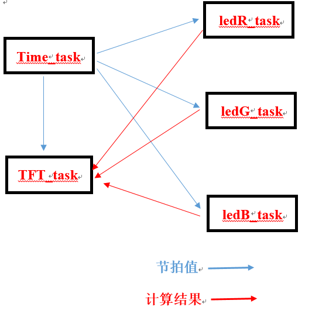

，# LONGAN_Freertos
    
        我是2020年应届生，喜欢LINUX。想从事内存管理这一方向的工作，但由于研究方向的原因，在意向工作领域中毫无经验。这
    些都没关系，可以从头再来，linux创始人Torvalds说过， “Talk is cheap. Show me the code.”。
    
        这是在开源软件方向中，了解到的最新的开源指令集RISC-V。本次实验采用开发板是《Longan Nano RISC-V GD32VF103CBT6 
    单片机带液晶显示屏开发板》。板上的资源有一个三色的LED灯，和一块小液晶屏。开发软件采用芯来科技提供的Nuclei Studio 
    IDE,非sipeed 矽速科技提供的vscode。由于学校封了，连串口下载器都没，采用的是USB DFU来下载（条件艰苦 └(^o^)┘）。虽然
    第一次编写FreeRTOS应用，但多年来积攒下来零碎的Linux编程经验，从配置到跑起来大概花了3天左右。本人会抽时间写一下博客分
    享一下心得，敬请期待。。。。。
    
         本次实验将实现对三色的LED灯作为临界资源进行控制，实验内容有：
    
    1、移植FreeRTOS和液晶屏
    
    2、创建计数节拍任务（Time_task）、液晶屏显示任务（TFT_task）、红灯控制任务（ledR_task）、绿灯控制任务（ledG_task）、
    蓝灯控制任务（ledB_task）。
    
    3、采用队列和二值信号量。
    
    4、资源空闲以后，计算计数节拍任务（Time_task）发来的节拍值，哪个任务最先满足，谁就获得控制权。采用二值信号量进行访问
    控制。
    
    5、条件分别是：计数节拍值能够被3整除，ledR_task获得控制权；被5整除，ledG_task获得控制权；被7整除，ledB_task获得控
    制权。
    
    6、ledR_task获取资源后占用5个计数节拍， ledG_task获取资源后占用7个计数节拍， ledB_task获取资源后占用3个计数节拍。

        
        
        
        
    Nuclei Studio IDE下载地址：https://www.nucleisys.com/download.php
    USB DFU下载工具：https://dl.sipeed.com/LONGAN/Nano/Tools
    个人博客：更新中....
    
       

# 注意，本次实验没有采用串口以及jtag进行调试，实时性不是很准。

